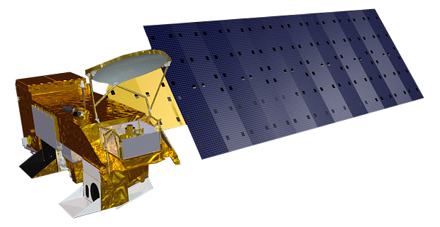

```{r setup, include=FALSE}
knitr::opts_chunk$set(echo = TRUE)
```


## La température des océans

- résumé : voir l'évolution de la température des océans dans le temps, mesurée par satellite.
- compétences : pratiquer une démarche scientifique, réaliser une expérience, s'approprier des outils, se situer dans l'espace et dans le temps
- durée : 45 min
- lexique : température, satellite
- expérience : oui
- matériel : bocal, thermomètre infra-rouge (~15 euros)
- objectif : comprendre la mesure de la température des océans par satellite. Prendre conscience de l'évolution de la température des océans dans le temps et dans l'espace.

## Déroulement

- expérience : mesurer la température d'un bocal d'eau chaude et d'un bocal d'eau froide avec un thermomètre infra-rouge.
  - le thermomètre infrarouge permet de mesurer la température de l'eau à distance. On comprend ainsi comment le satellite mesure la température de l'eau des océans depuis l'espace.
- observation des cartes de la zone d'intérêt. 3 cartes sont disponibles : celle de l'année en cours, il y a 10 ans et il y a 20 ans.
- observation du graphique de la zone d'intérêt
- conclure : "nous observons (ou non) un changement de la température dans notre zone étudiée"


## Documents supports

Les pages qui suivent sont à imprimer et distribuer aux élèves.

\newpage

# Etude de la température des Océans par satellite

Les satellites mesurent en continu la température des océans. Nous avons reproduit ce qu'ils font.

## Expérience :

Consigne : noter la température mesurée sous chaque bocal.

```{r, echo = FALSE, out.width="100%",fig.align="center"}
knitr::include_graphics("../pictures/wasserglaser.png")
```

## Satellite

Voici le satellite appelé MODIS qui mesure la température des océans depuis l'espace.

```{r, echo = FALSE, out.width="100%",fig.align="center",out.width = "150%"}

```

\newpage

## Cartes des températures annuelles moyennes de la mer de notre zone étudiée : 

Nom de la zone étudiée : ______________________

```{r mapsst,include=T,eval=T,echo=F, message=FALSE, warning=FALSE,fig.width=8,fig.align="center",out.width = "140%"}
library(rasterVis)
library(ggplot2)
#load sst modisA data
sst<-stack("../../../datalocal/modis/sst")

#e <- extent(-15,-14,17,19)
#e <- extent(-1.5,0.5,49.17,49.8)
e <- extent(params$xmin,params$xmax,params$ymin,params$ymax)


pipo <- crop(sst, e)
pipo2<-focal(pipo[[1]], w=matrix(1/9,nrow=3,ncol=3))
for(i in 2:dim(pipo)[3]){
        pipo2<-stack(pipo2,focal(pipo[[i]], w=matrix(1/9,nrow=3,ncol=3)))
}
names(pipo2)<-gsub("X","Année ",names(pipo))

plt1<-gplot(pipo2[[c(1,round(median(c(1,dim(pipo2)[3]))),dim(pipo2)[3])]])+geom_raster(aes(fill=value))+
        geom_contour(aes(z=value),color="light grey")+
        facet_wrap(~variable,ncol=1)+
        #scale_colour_gradient2()+
        scale_fill_distiller(palette="RdBu",na.value="white",name="Température\nde l'eau (°C)")+
        theme_bw()+xlab("")+ylab("")+
        borders("world",fill="light grey",colour="light grey")+
        coord_quickmap(xlim=c(e@xmin,e@xmax),ylim=c(e@ymin,e@ymax))
plot(plt1)


```

      
## Graphique de l'évolution de la température annuelle dans le temps

```{r tssst,include=T,eval=T,echo=F, message=FALSE, warning=FALSE,fig.align="center"}

tspipo<-cellStats(pipo2,mean)
tssd<-cellStats(pipo2,sd)

tspipo<-data.frame(year=as.numeric(substr(names(tspipo),7,10)),sst=tspipo,sd=tssd)


plt<-ggplot(tspipo,aes(x=year,y=sst))+geom_line()+theme_bw()+
  xlab("Année")+ylab("Température moyenne (°C)")
print(plt)

```

      
## Conclusion

Décris les évolutions de la température que tu vois sur les cartes et l'évolution de la température moyenne de la zone :

```{r carreaux,include=T,eval=T,echo=F, message=FALSE, warning=FALSE,fig.align="center",out.width = "90%"}
knitr::include_graphics("../pictures/carreaux.png")
```

     
