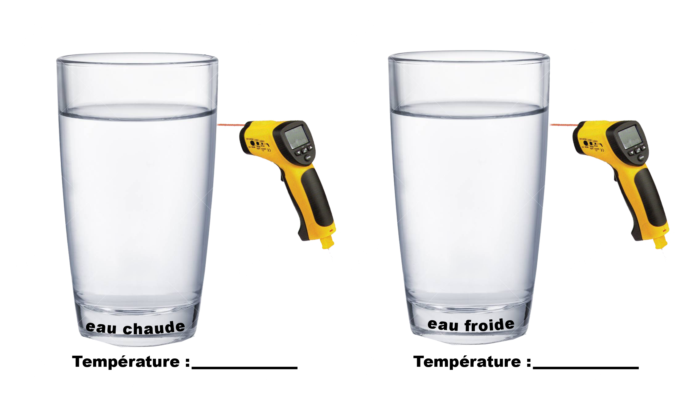

```{r setup, include=FALSE}
knitr::opts_chunk$set(echo = TRUE)
```


## Sea surface temperature

- Summary: Satellite measurements show how the sea temperature changed over time
- Main competence: Practice a scientific way of working
- Time: 45 min
- Vocabulary: temperature, satellite
- Experiment: yes
- Equipment: jar, infrared thermometer
- Objective: Understand how a satellite can measure the temperature of the ocean. Become aware of the evolution of the sea temperature over time and in a certain area.

## Process

- Experiment: Measure the temperature by using an infrared thermometer, a jar of hot water and a jar of cold water.
  - This is to understand how a satellite measures the sea temperature. 
- Observe the maps of our region of interest. (3 maps are available: current year, 10 years ago, 20 years ago)
- Observe the graph of our region of interest
- Conclusion: "We can see the temperature change in our area."

## Documents

Print the following student worksheet)

\newpage

## Study the sea temperature with satellites

European satellites are constantly measuring the sea temperature. We imitated what they do.

## Experiment:

Task: Note down the temperature measured underneath each jar

```{r, echo = FALSE, out.width="100%",fig.align="center"}

```

## Satellite

Here is the satellite called MODIS that measures ocean temperature from space.

```{r, echo = FALSE, out.width="100%",fig.align="center",out.width = "150%",dpi=10}
knitr::include_graphics("../pictures/Aqua_spacecraft_model.png")
```

\newpage

## Map of the sea surface temperature of the study area

Name of the study area : ______________________

```{r mapsst,include=T,eval=T,echo=F, message=FALSE, warning=FALSE,fig.width=8,fig.align="center",out.width = "140%"}
library(rasterVis)
library(ggplot2)
#load sst modisA data
sst<-stack("../../../datalocal/modis/sst")

#e <- extent(-15,-14,17,19)
#e <- extent(-1.5,0.5,49.17,49.8)
e <- extent(params$xmin,params$xmax,params$ymin,params$ymax)


pipo <- crop(sst, e)
pipo2<-focal(pipo[[1]], w=matrix(1/9,nrow=3,ncol=3))
for(i in 2:dim(pipo)[3]){
        pipo2<-stack(pipo2,focal(pipo[[i]], w=matrix(1/9,nrow=3,ncol=3)))
}
names(pipo2)<-gsub("X","Year ",names(pipo))

plt1<-gplot(pipo2)+geom_raster(aes(fill=value))+
        #geom_contour(aes(z=value),color="light grey")+
        facet_wrap(~variable)+
        #scale_colour_gradient2()+
        scale_fill_distiller(palette="RdBu",na.value="white",name="Sea surface\ntemperature (oC)")+
        theme_bw()+xlab("")+ylab("")+
        borders("world",fill="light grey",colour="light grey")+
        coord_quickmap(xlim=c(e@xmin,e@xmax),ylim=c(e@ymin,e@ymax))
plot(plt1)


```

      
## Plot of the temporal evolution of the annual sea surface temperature

```{r tssst,include=T,eval=T,echo=F, message=FALSE, warning=FALSE,fig.align="center"}

tspipo<-cellStats(pipo2,mean)
tssd<-cellStats(pipo2,sd)

tspipo<-data.frame(year=as.numeric(substr(names(tspipo),6,9)),sst=tspipo,sd=tssd)


plt<-ggplot(tspipo,aes(x=year,y=sst))+geom_line()+theme_bw()+
  xlab("Year")+ylab("Averaged sea surface temperature (oC)")
print(plt)

```

      
## Conclusion

Describe the temperature changes you see on the maps and the evolution of the average temperature of the area:

```{r carreaux,include=T,eval=T,echo=F, message=FALSE, warning=FALSE,fig.align="center",out.width = "90%"}
knitr::include_graphics("../pictures/carreaux.png")
```

     
